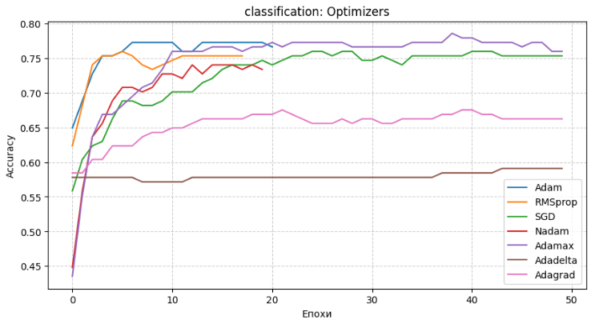
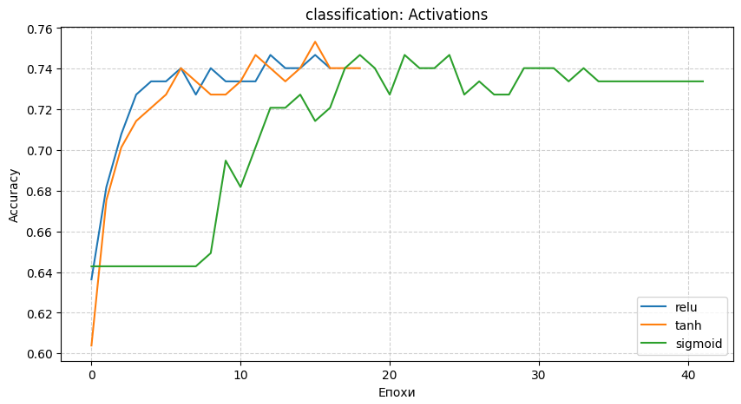
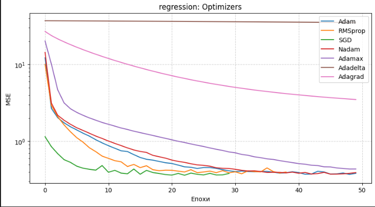
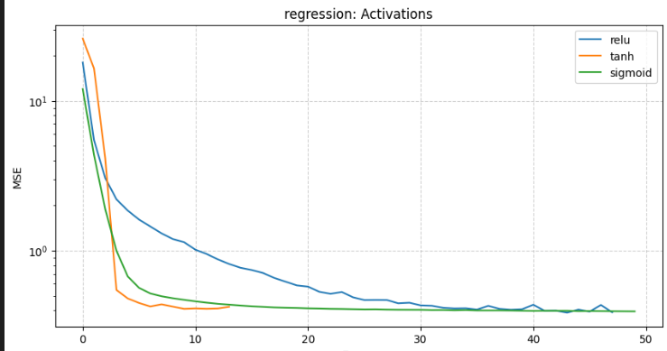

# 🧠 Neural Network Exploration | Lab 1

A professional implementation of **Fully Connected Neural Networks (MLP)** using the Keras `Sequential` API. This laboratory work explores the impact of architectural choices on model performance across diverse datasets.

---

## 📌 Project Overview

This project focuses on hyperparameter tuning and comparative analysis of deep learning models. It covers:

- **Regression Tasks:** Predicting numerical values (Wages, Wine Quality).
- **Classification Tasks:** Binary diagnostic prediction (Diabetes).
- **Optimization Analysis:** Comparing 5 different optimizers.
- **Activation Analysis:** Comparing 3 core activation functions.

---

## 🚀 Key Features

- ✅ **Automated Pipeline:** Scripts handle data scaling, splitting, training, and evaluation automatically.
- 📈 **Visualization:** Automatic generation of Loss/Accuracy curves saved directly to disk.
- 🛡️ **Early Stopping:** Implemented to find the optimal epoch and prevent overfitting.
- 📁 **Clean Architecture:** Strict separation of source code, data, and visual results.

---

## 🧪 Experiments & Hyperparameters

The model performance is evaluated by iterating through the following configurations:

### 1. Optimizers Comparison

- `Adam`, `RMSprop`, `SGD`, `Nadam`, `Adamax`

### 2. Activation Functions Comparison

- `ReLU` (Rectified Linear Unit)
- `Tanh` (Hyperbolic Tangent)
- `Sigmoid`

---

## 📊 Results Visualization

Training dynamics are captured for each experiment. Below is a comparison of performance across different configurations.

### **Diabetes Classification**

|                Optimizers Comparison                 |                 Activation Comparison                  |
| :--------------------------------------------------: | :----------------------------------------------------: |
|  |  |

### **Wine Quality Regression**

|                  Optimizers Comparison                  |                   Activation Comparison                   |
| :-----------------------------------------------------: | :-------------------------------------------------------: |
|  |  |

---

## Key Findings

**ReLU Convergence:** ReLU consistently outperformed other activations in terms of convergence speed and final accuracy.

**Optimizer Stability:** Adam and Nadam provided the most stable validation loss across all datasets, while SGD required significantly more tuning.

**Data Scaling:** Standardization is mandatory. Without StandardScaler, the loss functions (especially MSE for regression) often failed to converge or resulted in exploding gradients.
